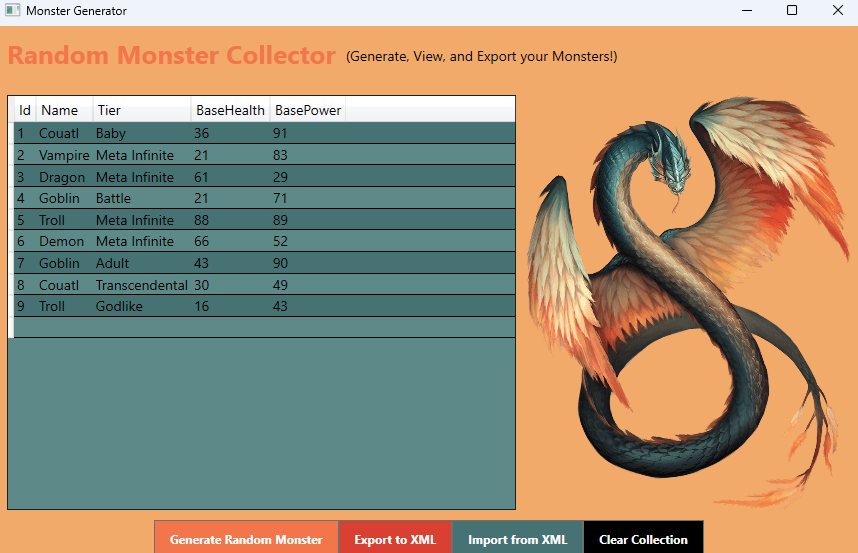
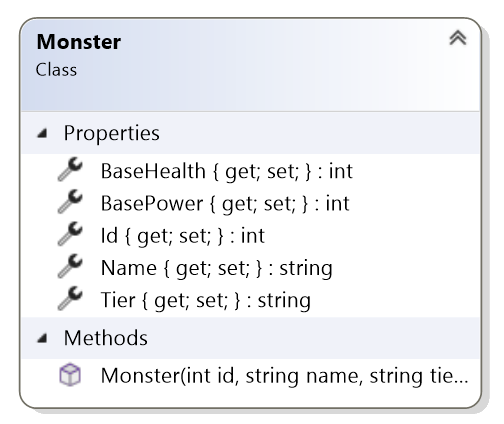
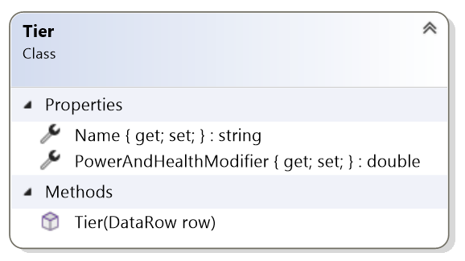

# Labo-5---Disconnected

In dit labo ga je aan de slag met ADO.NET disconnected. Je bouwt een monster database waarin je zelf monsters toevoegt en opslaat. Je leert hoe je deze data weergeeft in een WPF DataGrid en exporteert naar XML.

<p align="center">
    
</p>


**Doelstellingen:**
- Werken met DataTable en DataSet
- Data toevoegen in-memory zonder databaseverbinding
- Data tonen in een WPF DataGrid
- Data importeren en exporteren via XML

## 1. DataTables aanmaken

Je start met het aanmaken van twee DataTables:
 - Eén tabel voor de monsters met de volgende eigenschappen: Id, Name, Tier, BasePower en BaseHealth.
 - Eén tabel voor de tiers waarin per tier een: Name en PowerAndHealthModifier eigenschap wordt bijgehouden.

Behoud de volgorde van de bovenstaande eigenschappen voor de structuur van deze tabellen. Gebruik de onderstaande class diagram als hulpmiddel.




Vul de volgende twee methodes aan in `MonsterData`:

```
private static void CreateMonsterDataTable()
{
    // throw new NotImplementedException();
}

private static void CreateTierDataTable()
{
    // throw new NotImplementedException();
}
```

## 2. TierDataTable vullen

Vul de TierDataTable met verschillende monster-tiers en hun bijhorende krachtmodifiers.

Gebruik de onderstaande tabel als voorbeeld van de data in de `_tierDataTable`.

| Name    | PowerAndHealthModifier |
| -------- | ------- |
| Baby  | 1    |
| Battle | 1.2 |
| Adult    | 1.5    |
| Ancient    | 2    |
| Astral    | 3    |
| Godlike    | 10    |
| Transcendental | 20 |
| Meta Infinite| 1000 |


Vul de onderstaande methode aan in `MonsterData`:

```
private static void FillTierDataTable()
{
    // throw new NotImplementedException();
}
```

## 3. DataGrid koppelen

Koppel de MonsterDataTable aan een WPF DataGrid, zodat alle toegevoegde monsters meteen zichtbaar zijn in de UI. Bind de `ItemSource` eigenschap van het `DataGrid` van `MainWindow` met de `MonsterDataTable`.

Voorzie ook een knop waarmee de gebruiker alle monsters in één klik kan verwijderen uit de tabel.

```
public MainWindow()
{
    InitializeComponent();
    // TODO: DataTable koppelen aan DataGrid
}

private void ClearMonsters_Click(object sender, RoutedEventArgs e)
{
    // TODO: alle monsters verwijderen
}
```

## 4. XML Import + Export

Implementeer functionaliteit waarmee de gebruiker:
- Monsters kan exporteren naar een XML-bestand.
- Monsters kan importeren vanuit een XML-bestand.

Gebruik hiervoor een OpenFileDialog en SaveFileDialog om een bestand te selecteren. Verder gebruik je de ADO.NET functionaliteit ReadXml() en WriteXml() op de juiste DataTable of DataSet.

```
private void ImportFromXml_Click(object sender, RoutedEventArgs e)
{
    // TODO: laat de gebruiker een bestand selecteren en
    // importeer de gegevens met behulp van MonsterData
}

private void ExportToXml_Click(object sender, RoutedEventArgs e)
{
    // TODO: laat de gebruiker een bestand selecteren en 
    // exporteer de gegevens met behulp van MonsterData
}
```